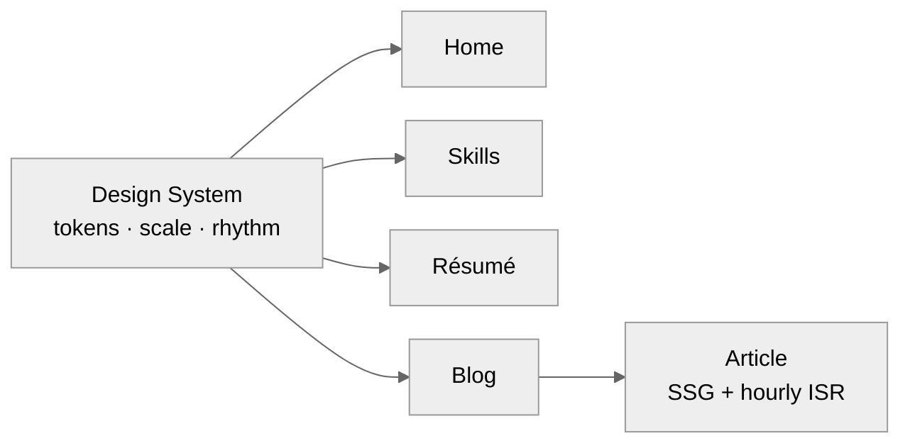

# VINAY KUMAR L

**Software Engineer - 1**

Building scalable systems from first principles — focused on what matters,<br/>and sharpened by modern tools and human-AI collaboration.

     

[Overview](#overview)&nbsp;&nbsp;·&nbsp;&nbsp;[Design System](#design-system)&nbsp;&nbsp;·&nbsp;&nbsp;[Tech Stack](#tech-stack)&nbsp;&nbsp;·&nbsp;&nbsp;[Structure](#project-structure)&nbsp;&nbsp;·&nbsp;&nbsp;[Getting Started](#getting-started)&nbsp;&nbsp;·&nbsp;&nbsp;[Routes](#routes)&nbsp;&nbsp;·&nbsp;&nbsp;[Deployment](#deployment)

---

## Overview

A minimal, bold, design-engineered personal site.

> **Type, rhythm, and motion are treated as a system — not decoration.**

Four surfaces — **Home**, **Skills**, **Résumé**, and **Blog** — share one tightly-defined visual language, so consistency is structural rather than manual.

- **Design-system first** — one type scale, one spacing rhythm, one alignment, one page shell, one set of button primitives.
- **First-class theming** — light/dark via `next-themes` with an OKLCH token system and a cross-fading toggle.
- **Considered motion** — route transitions and skeleton loading states (Framer Motion).
- **Accessible by default** — skip-to-content link, semantic landmarks, focus-visible rings, `aria-label`s, reduced-motion support.
- **Rendering** — Server Components, statically generated, with hourly ISR on the blog.
- **SEO-ready** — per-page metadata, generated Open Graph cards, `sitemap.xml`, `robots.txt`, and JSON-LD.
- **Tested & CI-gated** — Vitest suite plus a GitHub Actions pipeline (typecheck · lint · test · build).
- **Modern stack** — Next.js App Router on React 19, bundled with Turbopack.



<sub>One source of truth flows into every surface — the diagram's spacing mirrors the site's own 24 / 48px rhythm.</sub>

---

## Design System

The source of truth lives in `app/globals.css` (tokens) and the shared components under `components/`.

### Type scale

Hierarchy is carried by **weight and a deliberate 2× jump** — not by a long ladder of sizes. Minimal, with bold as the lead.

| Level          | Token / classes        | Size (mobile → desktop) |  Weight  | Used for                              |
| :------------- | :--------------------- | ----------------------: | :------: | :------------------------------------ |
| **Display**    | `text-main-heading`    |               36 → 48px |   Bold   | Name, every page title, article title |
| **Heading**    | `text-2xl sm:text-3xl` |               24 → 30px |   Bold   | Sections, blog post titles            |
| **Subheading** | `text-xl`              |                    20px | Semibold | Card / group titles                   |
| **Body**       | `text-lg`              |                    18px | Regular  | Paragraphs, excerpts, descriptions    |
| **Meta**       | `text-sm`              |                    14px | Regular  | Dates, read time, captions            |

### Spacing rhythm

A two-step vertical rhythm keeps every page on the same grid.

| Step      | Token                   | Value | Applies to                                   |
| :-------- | :---------------------- | :---: | :------------------------------------------- |
| **Line**  | `space-y-6` / `gap-6`   | 24px  | Stacked intro lines (brand → role → summary) |
| **Block** | `gap-12` / `space-y-12` | 48px  | Major blocks and content sections            |

### Alignment

Content sits in a column nudged **a hair left of center** on large screens (`lg:-translate-x-8`, ~32px) — present, not aggressive. Text is left-aligned throughout.

| Surface                          |   Column    | Reading measure |
| :------------------------------- | :---------: | :-------------: |
| Home (hero)                      | `max-w-2xl` |        —        |
| Skills · Résumé · Blog · Article | `max-w-4xl` |   `max-w-2xl`   |

### Page shell

Every surface is assembled from the same shell, so navigation and chrome never drift:

- **Wordmark** — `VINAY KUMAR L`, linking home on every inner page.
- **Theme toggle** — a fixed Sun ⇄ Moon control, present on all routes.
- **Social footer** — the same outline-pill GitHub / LinkedIn links close out each page.

### Theming & color

`next-themes` (class strategy) toggles an **OKLCH** token set defined for `:root` and `.dark`, so every surface, border, and control follows the active theme.

```css
--background  --foreground        /* page     */
--card        --card-foreground
--muted       --muted-foreground
--border      --ring              /* controls */
```

### Buttons

Three intentional types, each from a single source so they never drift:

| Type             | Shape                | Role                        | Source                        |
| :--------------- | :------------------- | :-------------------------- | :---------------------------- |
| **Primary**      | Filled pill          | Main action (e.g. Download) | inline / `bg-foreground`      |
| **Secondary**    | Outline pill         | Social links                | `components/social-links.tsx` |
| **Theme toggle** | Circular icon button | Sun ⇄ Moon cross-fade       | `components/theme-toggle.tsx` |

Brand glyphs (GitHub, LinkedIn) live in `components/icons.tsx` — one mark, reused everywhere.

### Typography

- **Geist Sans / Mono** — interface and code, loaded via `next/font`.
- **Wordmark** — set in Circular Std where present, with a graceful system fallback by design.[^wordmark]

[^wordmark]: No font file ships for the wordmark — it renders in the system fallback intentionally, keeping the bundle lean while reserving the Circular Std treatment in the token (`--font-circularStd-Light`).

---

## Tech Stack

| Area       | Choice                                                        |
| :--------- | :------------------------------------------------------------ |
| Framework  | [Next.js 15](https://nextjs.org) (App Router · Turbopack)     |
| Language   | [TypeScript 5](https://www.typescriptlang.org)                |
| UI runtime | [React 19](https://react.dev)                                 |
| Styling    | [Tailwind CSS v4](https://tailwindcss.com) · `tw-animate-css` |
| Theming    | [next-themes](https://github.com/pacocoursey/next-themes)     |
| Motion     | [Framer Motion](https://www.framer.com/motion/)               |
| Primitives | [Radix UI](https://www.radix-ui.com) (shadcn/ui style)        |
| Icons      | [lucide-react](https://lucide.dev) + custom brand glyphs      |

---

## Project Structure

<details>
<summary><strong>View the full tree</strong></summary>

<br/>

```text
personal-website/
├── app/
│   ├── layout.tsx          # Root layout · fonts · ThemeProvider
│   ├── page.tsx            # Home / hero
│   ├── globals.css         # Design tokens + system CSS
│   ├── skills/page.tsx
│   ├── resume/page.tsx
│   └── blog/
│       ├── page.tsx        # Post index
│       └── [slug]/page.tsx # Article
├── components/
│   ├── icons.tsx           # Shared brand glyphs (GitHub, LinkedIn)
│   ├── social-links.tsx    # Outline-pill social buttons
│   ├── theme-provider.tsx  # next-themes wrapper
│   ├── theme-toggle.tsx    # Cross-fade Sun/Moon toggle
│   ├── page-transition.tsx # Route motion
│   ├── resume-viewer.tsx   # PDF viewer + fallback
│   ├── loading/            # Per-route skeletons
│   └── ui/                 # Radix / shadcn primitives
├── hooks/                  # use-loading · use-mobile
├── lib/                    # utils
└── public/                 # static assets
```

</details>

---

## Getting Started

> [!NOTE] > **Prerequisites** — Node.js **18.18+** (20+ recommended) and npm.

```bash
# 1 · Install dependencies
npm install

# 2 · Start the dev server (Turbopack)
npm run dev
```

Open <http://localhost:3000> — edits to `app/page.tsx` hot-reload instantly.

---

## Scripts

| Command         | Description                             |
| :-------------- | :-------------------------------------- |
| `npm run dev`   | Start the dev server with Turbopack     |
| `npm run build` | Production build                        |
| `npm run start` | Serve the production build              |
| `npm run lint`  | Lint with ESLint (`eslint-config-next`) |
| `npm test`      | Run the Vitest test suite               |

---

## Routes

| Path           | Page                                     |
| :------------- | :--------------------------------------- |
| `/`            | Home — name, role, summary, social links |
| `/skills`      | Toolkit & core principles                |
| `/resume`      | Résumé viewer with PDF download          |
| `/blog`        | Writing index                            |
| `/blog/[slug]` | Individual article                       |

---

## Deployment

Optimized for [**Vercel**](https://vercel.com/new) — push the repo, import it, and ship.

> [!TIP]
> No environment variables are required for the base site. For other targets, see the [Next.js deployment docs](https://nextjs.org/docs/app/building-your-application/deploying).

---

<div align="center">

Designed & built by **Vinay Kumar L**

[GitHub&nbsp;↗](https://github.com/v-shadowmaster)&nbsp;&nbsp;·&nbsp;&nbsp;[LinkedIn&nbsp;↗](https://linkedin.com/in/vinay-kumar-l)

<sub>One type scale · one rhythm · one design system.</sub>

</div>
